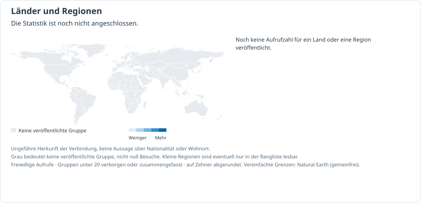

<!-- crimemaps:visual-home:start -->
<p> </p>
<p> </p>
<p> </p>
<p><sub>KI-generierte Stadtansichten bei Tag und Nacht. Sie zeigen keine gemeldeten Ereignisse.</sub></p>
<!-- crimemaps:visual-home:end -->

# CrimeMaps Stuttgart: Polizeimeldungen auf der Karte

[English](README.md) · [Deutsch](README.de.md) · [中文](README.zh-CN.md)

CrimeMaps zeigt erfasste Polizeimeldungen für Stuttgart, die darin genannten Orte und gleichartige Einrichtungen im Umfeld. Jeder Eintrag verlinkt seine Quelle. Berlin ist der Einstieg zu den 14 Stadtkarten; jede Stadt hat eine eigene Projektseite und eigene Kartendaten.

CrimeMaps ist ein offenes Projekt in einer frühen Version. Datenabdeckung, Ortszuordnung, Übersetzungen und Bedienung werden weiter verbessert; Angaben können fehlen oder Fehler enthalten. Wer mithelfen möchte, ist willkommen: durch Fragen, belegte Korrekturen oder Beiträge zum Code, zu den Texten und zur Bedienung.

[Kartenadresse](https://ln6666.github.io/crimemaps-Stuttgart/)

[Karte lesen](#read) · [Quellen](#sources) · [Lokal starten](#run) · [Aktualisierungen](#updates) · [Datenschutz und Hinweise](#privacy) · [Aufrufe nach Land](#stats) · [Weitere Städte](#cities) · [Lizenz](#license)

<a id="status"></a>

## Projektstand

Dieses Repository enthält den Quellcode der eigenständigen Stadtkarte. Hinweise zu Veröffentlichung und Aktualisierung stehen unter der Kartenadresse oben. Die Sammlung umfasst ausgewählte Meldungen, nicht sämtliche Straftaten der Stadt.

<a id="read"></a>

## Die Karte lesen

Wähle einen Monat und öffne ein Gebiet, eine Straße oder einen Ort, um die zugehörigen Meldungen zu lesen. Veröffentlichungsdatum und genannte Ereigniszeit bleiben getrennt. Fehlt eine Ereigniszeit, bleibt sie unbekannt.

Die Sechsecke zählen die berücksichtigten Meldungen mit einer geeigneten Ortsangabe. Jede Meldung zählt im gewählten Jahr und pro angezeigter Sechseckgröße höchstens einmal. Die gespeicherten Meldungsmonate bestimmen die Jahreszuordnung; die Monatsauswahl filtert Meldungslisten und Details. Eine Meldung kann mehrere Ereignisse, Ermittlungen, einen Polizeieinsatz oder Hintergrundinformationen enthalten. Die Zahlen erfassen nicht alle Straftaten und messen weder ein persönliches Risiko noch die Sicherheit einer Stadt.

Orte werden nur so genau dargestellt, wie es die Quelle erlaubt. Eine Straße, Verkehrslinie oder ein Gebiet kann als Orientierung dienen, ohne den genauen Ereignisort zu bezeichnen. Meldungen mit bloßer Bezirksangabe und nicht lokalisierbare Orte bleiben ohne erfundenen Kartenpunkt in der Liste.

Eine dunklere Markierung zeigt einen belegten Bezug zu gleichartigen Orten aus einer Meldung. Sie bedeutet nicht, dass eine Straftat in einem bestimmten Geschäft stattgefunden hat. Lesen Sie Angaben zu Einrichtungen im Umfeld zusammen mit der Originalmeldung.

Chinesische und englische Übersetzungen helfen beim Lesen der deutschen Polizeitexte. Die Originalverweise bleiben erhalten. Übersetzungen können Fehler enthalten und liefern keine Adresse oder genaue Position, die in der Quelle fehlt.

Software sammelt die Quellen und bereitet die Karte auf. KI kann beim Lesen und Einordnen helfen. Ihre Vorschläge müssen anhand der Quelle geprüft werden.

Bei den erfassten Meldungen werden Quellen, Kategorien, Ortsangaben und ihre Anzeige auf der Karte geprüft. Wie oft die eingesetzten KI-Modelle bei einer repräsentativen Auswahl aus allen 14 Städten richtigliegen, wurde nicht gemessen. Fehler und fehlende Angaben sind weiterhin möglich.

Die Kennzeichnung „Hinweis auf ein mögliches Hassmotiv“ wird mit KI-Unterstützung aus ausdrücklichen Anzeichen von Vorurteilen im Text abgeleitet. Sie ist keine polizeiliche Feststellung. Identität, Herkunft oder Wohnviertel allein belegen kein Motiv.

<a id="sources"></a>

## Quellen und erfasster Umfang

<!-- crimemaps:police-website:start -->
[Polizei-Website](https://ppstuttgart.polizei-bw.de/)
<!-- crimemaps:police-website:end -->

Meldungsquelle: [Polizeipräsidium Stuttgart / Presseportal](https://www.presseportal.de/blaulicht/nr/110977).

Polizeiliche Pressemitteilungen bilden eine Auswahl öffentlicher Meldungen ab. Eine fehlende Meldung, ein ausgeschlossener Artikel oder ein unbekannter Ort bedeutet nicht, dass dort nichts geschehen ist. Der Zuständigkeitsbereich einer Polizeibehörde kann über die Stadt hinausreichen; Einträge werden daher auf ihren Bezug zum Stadtgebiet geprüft.

Straßen, Ortsangaben und Umrisse stammen aus [OpenStreetMap](https://www.openstreetmap.org/copyright), darunter [Geofabrik-Auszüge](https://download.geofabrik.de/europe/germany.html). Quellen und Genauigkeit der Ortsangaben bleiben nachvollziehbar. Eine Abbildung in diesem README steht für die Stadt, nicht für einen Ereignisort.

<a id="run"></a>

## Lokal starten

Die Kartenoberfläche benötigt Node.js 22 und npm. Für die Werkzeuge zur Quellenverarbeitung werden Python 3.12 und [uv](https://docs.astral.sh/uv/) benötigt.

```sh
git clone https://github.com/LN6666/crimemaps-Stuttgart.git
cd crimemaps-Stuttgart
npm --prefix web ci
VITE_CRIMEMAPS_CITY=stuttgart npm --prefix web run dev
```

Öffne http://127.0.0.1:5173. Das Repository enthält den Code. Geprüfte Kartendaten werden getrennt bereitgestellt und nicht in Git gespeichert. Ohne ein passendes Datenpaket kann die Oberfläche keine Meldungen dieser Stadt anzeigen. Importiere das geprüfte Paket nach den Migrationshinweisen der Stadt in `web/public/safety/`; Quelldatenbanken und Prüfarchive gehören dort nicht hinein.

Für die Backend-Entwicklung installierst du die festgeschriebenen Abhängigkeiten und führst die vorhandenen lokalen Prüfungen aus:

```sh
uv sync --locked
uv run pytest test_suite/safety
```

Der Frontend-Build lautet `VITE_CRIMEMAPS_CITY=stuttgart npm --prefix web run build`. Ein erfolgreicher Build veröffentlicht keine Website und belegt keine vollständige Datenabdeckung.

<a id="contribute"></a>

## Mitwirken

Unter [Über die Karte sprechen](https://github.com/LN6666/crimemaps-Stuttgart/discussions) kannst du Erfahrungen und Vorschläge teilen. Unter [Problem melden](https://github.com/LN6666/crimemaps-Stuttgart/issues/new/choose) kannst du Fehler oder Korrekturen mit einer öffentlich zugänglichen Quelle melden. Für einen Beitrag musst du dich bei GitHub anmelden. Dein Konto und dein Text sind öffentlich. Bitte keine persönlichen oder sensiblen Angaben veröffentlichen. Dies ist kein Notruf und keine polizeiliche Meldestelle.

[Vorgeschlagene Änderungen ansehen](https://github.com/LN6666/crimemaps-Stuttgart/pulls) · [Hinweise zum Mitwirken](docs/CONTRIBUTING.de.md)

Reiche Code- oder Textänderungen als überschaubaren Pull Request ein. Siehe [die Hinweise zum Mitwirken](docs/CONTRIBUTING.de.md). Nenne bei einem Softwarefehler den Browser, kurze Schritte zur Reproduktion und gegebenenfalls einen öffentlichen Quellenlink. Personenbezogene Angaben, vollständige Polizeitexte, Datenbanken, Prüfarchive und Zugangsdaten gehören nicht in öffentliche Issues.

<a id="updates"></a>

## Aktualisierungen und Zuverlässigkeit

Neue Meldungen werden vor der Veröffentlichung auf Quelle, Inhalt, Ortsangaben und Darstellung im Browser geprüft. Erfassung und Prüfung brauchen Zeit; die Karte ist kein Echtzeitdienst. Schlägt eine Aktualisierung fehl, bleibt die bisherige nutzbare Karte erhalten. Die in der Karte genannten Erfassungsdaten und Einschränkungen beschreiben den jeweiligen Stand.

Verfolge [Veröffentlichungen](https://github.com/LN6666/crimemaps-Stuttgart/releases) und [Code-Prüfungen](https://github.com/LN6666/crimemaps-Stuttgart/actions). Ältere Entwicklungsnotizen bleiben in `docs/` erhalten; der aktuelle Stadtstatus hier geht historischen Veröffentlichungsangaben vor.

<a id="privacy"></a>

## Datenschutz, Korrekturen und Sicherheit

[Hinweise und unbekannte Orte](docs/FEEDBACK.md)

Die Hintergrundkarte und externe Links verwenden Dienste anderer Anbieter. Beim Laden können Verbindungsdaten wie die IP-Adresse an sie übermittelt werden. Die Karte nennt ihre Quellen und Datenschutzhinweise.

Für Sicherheitsprobleme gilt [SECURITY.md](SECURITY.md). Wenn das Repository „Report a vulnerability“ anzeigt, nutze diesen privaten Meldeweg. Veröffentliche keine Zugangsdaten oder sensiblen Einzelheiten in einem öffentlichen Issue.

<a id="stats"></a>

## Kartenaufrufe nach Ländern oder Regionen

<picture>
  <source media="(max-width:640px)" srcset="docs/assets/visitors-by-country.de.mobile.svg">
  
</picture>

Karte und Rangliste zeigen die Länder-/Regionen-Seitenaufrufe dieser Stadt-Website aus GoatCounter, einschließlich Neuladen; Sprachwechsel und Kartenaktionen zählen nicht zusätzlich. Das sind weder eindeutige Personen noch README-Leser. Kleine Gruppen werden verborgen/zusammengefasst und Werte auf Zehner abgerundet. Grau bedeutet keine veröffentlichte Zahl, nicht null. Das Snapshot-Datum wird angezeigt; GitHub kann Bilder zwischenspeichern.

<a id="cities"></a>

## Die 14 Stadtprojekte

Berlin ist der Ausgangspunkt. Alle 14 Stadt-Repositories sind öffentlich zugänglich. Die Links öffnen den Quellcode und die Projektseiten. Die neuen Karten sind noch nicht online.

| Stadt | Projektseite |
| --- | --- |
| Berlin | [crimemaps-Berlin](https://github.com/LN6666/crimemaps-Berlin) |
| Hamburg | [crimemaps-Hamburg](https://github.com/LN6666/crimemaps-Hamburg) |
| München | [crimemaps-Munich](https://github.com/LN6666/crimemaps-Munich) |
| Köln | [crimemaps-Cologne](https://github.com/LN6666/crimemaps-Cologne) |
| Frankfurt am Main | [crimemaps-Frankfurt](https://github.com/LN6666/crimemaps-Frankfurt) |
| Düsseldorf | [crimemaps-Dusseldorf](https://github.com/LN6666/crimemaps-Dusseldorf) |
| Stuttgart | [crimemaps-Stuttgart](https://github.com/LN6666/crimemaps-Stuttgart) |
| Leipzig | [crimemaps-Leipzig](https://github.com/LN6666/crimemaps-Leipzig) |
| Dortmund | [crimemaps-Dortmund](https://github.com/LN6666/crimemaps-Dortmund) |
| Bremen | [crimemaps-Bremen](https://github.com/LN6666/crimemaps-Bremen) |
| Essen | [crimemaps-Essen](https://github.com/LN6666/crimemaps-Essen) |
| Dresden | [crimemaps-Dresden](https://github.com/LN6666/crimemaps-Dresden) |
| Hannover | [crimemaps-Hannover](https://github.com/LN6666/crimemaps-Hannover) |
| Nürnberg | [crimemaps-Nuremberg](https://github.com/LN6666/crimemaps-Nuremberg) |

<a id="license"></a>

## Lizenz und Hinweise

Der Projektcode steht unter [Apache-2.0](LICENSE). Für OpenStreetMap gelten eigene [ODbL- und Namensnennungsbedingungen](https://www.openstreetmap.org/copyright). Polizeipublikationen und andere Quellen behalten ihre jeweiligen Nutzungsbedingungen; die Codelizenz erlaubt nicht pauschal ihre Weiterverbreitung.

CrimeMaps ist ein unabhängiges Projekt, kein offizieller Polizeidienst. Lesen Sie die verlinkte Polizeimeldung, bevor Sie Schlüsse aus einem Eintrag ziehen. Die Karte ist kein Notfalldienst und misst keine persönliche Sicherheit. Für die Software gelten die Bedingungen in LICENSE.


<!-- crimemaps:public-notice:start -->
Die Website wird schrittweise verbessert. Meldungsinhalte werden wöchentlich aktualisiert; Karten und Einrichtungen im Umfeld (POIs) monatlich.

GPT und Doubao Lite unterstützen die Übersetzung. Chinesisch wird vorrangig geprüft. Etwa 90 % für Englisch und 85 % für Deutsch sind Projekteinschätzungen, keine Ergebnisse einer vollständigen Genauigkeitsprüfung. Einzelne Angaben können im Original erscheinen; bitte die Quelle prüfen.

Ausgewählte Polizeimeldungen und POLIZEIKARTE-Einträge behalten ihre Quellenlinks. Sie sind keine vollständige Kriminalitätsstatistik; Meldungszahlen sind keine Zahl unabhängiger Straftaten. POI-Umrisse und räumliche Bezüge lokalisieren keinen Vorfall. Dunklere Symbole kennzeichnen quellenbelegte Einrichtungstypen; Einrichtungen im Umfeld dienen als Bezug und belegen keine Straftat in einem Betrieb. Weitere Bezüge und Farben erklärt die Legende. Unbekannte Orte erhalten keine erfundenen Koordinaten.
<!-- crimemaps:public-notice:end -->
