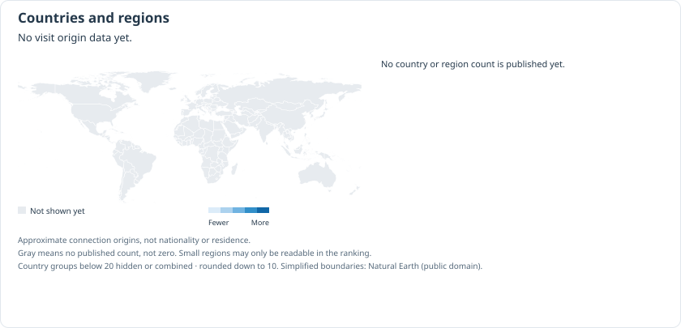

<!-- crimemaps:visual-home:start -->
<p> </p>
<p> </p>
<p> </p>
<p><sub>AI city illustrations, daytime and nighttime. They do not depict reported events.</sub></p>
<!-- crimemaps:visual-home:end -->

# CrimeMaps Stuttgart: police announcements on a map

[English](README.md) · [Deutsch](README.de.md) · [中文](README.zh-CN.md)

Browse the selected police announcements for Stuttgart, the places they mention and nearby facilities. Each announcement links to its source. Berlin is the starting point for 14 city projects, each with its own repository and map data.

This is an early open-source version, with plenty still to improve. Coverage, place matching, translations and usability have gaps; information can be missing or wrong. If you are interested, you are welcome to point out problems, suggest source-backed corrections, or help with the code, wording and user experience.

[Map address](https://ln6666.github.io/crimemaps-Stuttgart/)

[Reading the map](#read) · [Sources](#sources) · [Run locally](#run) · [Updates](#updates) · [Privacy and feedback](#privacy) · [Visits by country](#stats) · [Other cities](#cities) · [License](#license)

<a id="status"></a>

## Project status

This repository provides the independent city map source. Release and update information is shown at the map address above. The collection covers selected announcements, not all crime in the city.

<a id="read"></a>

## Reading the map

Select a month, then open an area, road or place to read the linked announcements. An event may have happened earlier than publication; if its time is not known, it stays unknown.

Hexagons show selected announcements with a location suitable for the totals. Each announcement counts at most once in the selected year and hexagon size. The saved announcement months define the yearly grouping; the month selector filters report lists and details. An announcement may describe several events, police activity or earlier events. These totals do not measure all crime, your chance of becoming a victim or how safe one city is compared with another.

A road, transport line or area may show a place mentioned in the source while the exact incident location remains unknown. Reports that name only a district, or cannot be located, remain in the list. No point is invented to fill the gap.

A darker place symbol marks a link to the type of place mentioned in an announcement. It does not establish that an offence happened at that business. Read the linked announcement to understand why the place is shown.

Where available, Chinese and English translations help readers understand the German police text. The original wording and links remain available. Translations may contain errors and do not add an address, time or precise location that the source did not give.

Software collects the sources and prepares the map. AI can assist with reading and classification; its suggestions need checking against the source.

Sources, categories, location descriptions and the way the map displays them are checked before announcements appear in a release. We have not measured how often each AI tool was correct across all 14 cities. Errors and missing information can remain.

A label such as ‘possible hate crime’ is an AI-assisted lead based on explicit evidence of bias in the narrative, not a finding by the police. Identity, origin or neighbourhood alone is not evidence of motive.

<!-- crimemaps:public-transit-reading:start -->
Click or tap a displayed public-transport route to highlight it and view its number, original source name and available source information. Where routes overlap, choose one from the list. Missing source names are marked. The route layer itself does not establish a link to a police announcement, and the routes loaded do not represent the complete city network. Ferries belong to “Other public transport”. An unverified source or an absent map route does not establish that no ferry service exists.
<!-- crimemaps:public-transit-reading:end -->

<a id="sources"></a>

## Sources and coverage

<!-- crimemaps:police-website:start -->
[Police website](https://ppstuttgart.polizei-bw.de/)
<!-- crimemaps:police-website:end -->

Report source: [Polizeipräsidium Stuttgart / Presseportal](https://www.presseportal.de/blaulicht/nr/110977).

Police press announcements are a selection of public reports. The absence of an announcement, an excluded article or an unknown location does not mean that no event occurred there. A police authority's service area may extend beyond the city; records must be checked against the city boundary.

Place information and mapped outlines use [OpenStreetMap](https://www.openstreetmap.org/copyright), including [Geofabrik extracts](https://download.geofabrik.de/europe/germany.html). Source links, collection dates and location limits are retained. The city illustration in this README identifies the project; it does not mark an event.

<a id="run"></a>

## Run locally

Use Node.js 22 and npm for the map interface. Python 3.12 and [uv](https://docs.astral.sh/uv/) are needed for the source-processing tools.

```sh
git clone https://github.com/LN6666/crimemaps-Stuttgart.git
cd crimemaps-Stuttgart
npm --prefix web ci
VITE_CRIMEMAPS_CITY=stuttgart npm --prefix web run dev
```

Open http://127.0.0.1:5173. The repository contains code; reviewed map data is delivered separately and is not committed to Git. Without a compatible city data bundle, the interface cannot show that city's records. Import the checked bundle into `web/public/safety/` using the city migration instructions; do not copy source databases or review archives there.

For backend development, install the locked dependencies and run the existing local checks:

```sh
uv sync --locked
uv run pytest test_suite/safety
```

The production frontend build is `VITE_CRIMEMAPS_CITY=stuttgart npm --prefix web run build`. Building code does not publish a website or prove that map data is complete.

<a id="contribute"></a>

## Contribute

[Discuss this map](https://github.com/LN6666/crimemaps-Stuttgart/discussions) to share your experience and suggestions. [Report a problem](https://github.com/LN6666/crimemaps-Stuttgart/issues/new/choose) for errors or corrections with a link to a public source. To leave a message, sign in to GitHub; your account and message are public. Do not include personal or sensitive information. This is not an emergency or police reporting service.

[Propose a change](https://github.com/LN6666/crimemaps-Stuttgart/pulls) · [Contribution guide](docs/CONTRIBUTING.en.md)

Use a focused pull request for code or wording changes. See [the contribution guide](docs/CONTRIBUTING.en.md). A software issue should include the browser, a short reproduction and a public source link where relevant. Leave personal information, full police texts, databases, review packages and credentials out of public issues.

<a id="updates"></a>

## Updates and reliability

New announcements are checked against their sources and location descriptions before appearing on the map. Collection and checking take time; this is not a live feed. If an update fails, the previous usable map stays available. Collection dates and visible limits explain what that version includes.

Follow [repository releases](https://github.com/LN6666/crimemaps-Stuttgart/releases) and [code checks](https://github.com/LN6666/crimemaps-Stuttgart/actions). Older development notes are retained in `docs/`; the current city status here takes precedence over historical deployment descriptions.

<a id="privacy"></a>

## Privacy, corrections and security

[feedback and unknown locations](docs/FEEDBACK.md)

Map tiles and external links use third-party providers. When you load those services, they may receive ordinary connection information such as an IP address. See the map's provider attribution and privacy notice before using an external service.

For security issues, see [SECURITY.md](SECURITY.md). If the repository shows ‘Report a vulnerability’, use that private route. Do not post credentials or sensitive details in a public issue.

<a id="stats"></a>

## Map page views by country or region

<picture>
  <source media="(max-width:640px)" srcset="docs/assets/visitors-by-country.en.mobile.svg">
  
</picture>

This map and ranking show this city website’s country/region page views from GoatCounter, including ordinary reloads; language changes and map operations do not add a count. These are not unique people or README readers. Small groups are hidden/combined and values round down to ten. Gray means no published count, not zero. The snapshot date is shown; GitHub may cache images.

<a id="cities"></a>

## The 14 city projects

Berlin is the default starting point. All 14 city repositories are public; the links below open their code and project pages. The new maps are still awaiting publication.

| City | Repository |
| --- | --- |
| Berlin | [crimemaps-Berlin](https://github.com/LN6666/crimemaps-Berlin) |
| Hamburg | [crimemaps-Hamburg](https://github.com/LN6666/crimemaps-Hamburg) |
| Munich | [crimemaps-Munich](https://github.com/LN6666/crimemaps-Munich) |
| Cologne | [crimemaps-Cologne](https://github.com/LN6666/crimemaps-Cologne) |
| Frankfurt am Main | [crimemaps-Frankfurt](https://github.com/LN6666/crimemaps-Frankfurt) |
| Düsseldorf | [crimemaps-Dusseldorf](https://github.com/LN6666/crimemaps-Dusseldorf) |
| Stuttgart | [crimemaps-Stuttgart](https://github.com/LN6666/crimemaps-Stuttgart) |
| Leipzig | [crimemaps-Leipzig](https://github.com/LN6666/crimemaps-Leipzig) |
| Dortmund | [crimemaps-Dortmund](https://github.com/LN6666/crimemaps-Dortmund) |
| Bremen | [crimemaps-Bremen](https://github.com/LN6666/crimemaps-Bremen) |
| Essen | [crimemaps-Essen](https://github.com/LN6666/crimemaps-Essen) |
| Dresden | [crimemaps-Dresden](https://github.com/LN6666/crimemaps-Dresden) |
| Hanover | [crimemaps-Hannover](https://github.com/LN6666/crimemaps-Hannover) |
| Nuremberg | [crimemaps-Nuremberg](https://github.com/LN6666/crimemaps-Nuremberg) |

<a id="license"></a>

## License and disclaimer

Project code is licensed under [Apache-2.0](LICENSE). OpenStreetMap data has its own [ODbL and attribution terms](https://www.openstreetmap.org/copyright). Police publications and other source material retain their respective terms; the code license does not grant a blanket right to redistribute them.

CrimeMaps is an independent project, not an official police service. Read the linked police text before drawing conclusions about a record. The map is not an emergency service or a measure of personal safety. The software is provided under the terms in LICENSE.


<!-- crimemaps:public-notice:start -->
The site is being improved. Announcement content is updated weekly; maps and nearby facilities (POIs) are updated monthly.

GPT and Doubao Lite assist with translation. Chinese is the priority review version. English about 90% and German about 85% are project estimates, not results of a full accuracy assessment. Some details may still show the original text; check the source.

Selected police announcements and POLIZEIKARTE records retain source links. They are not a complete crime inventory; announcement totals are not counts of distinct offences. POI outlines and reference extents do not locate an incident. Darker symbols mark source-linked place types; nearby facilities are context and do not establish an offence at a business. Read other extents and colours in the legend. Unknown locations receive no invented coordinates.
<!-- crimemaps:public-notice:end -->
